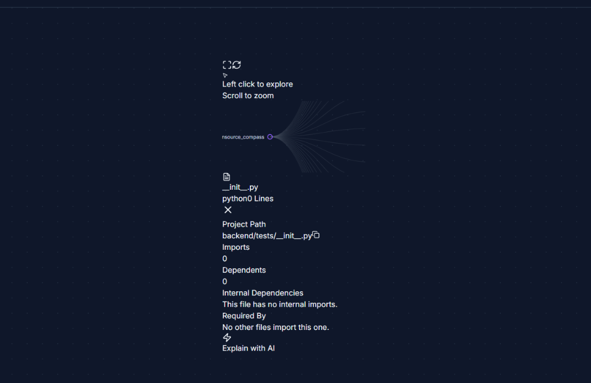
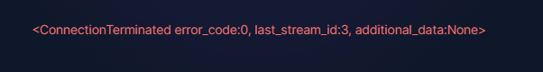
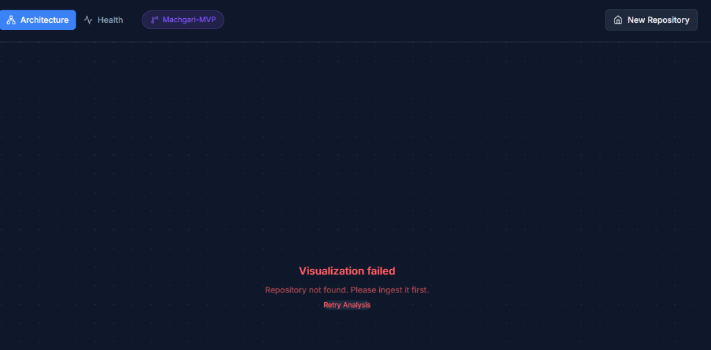
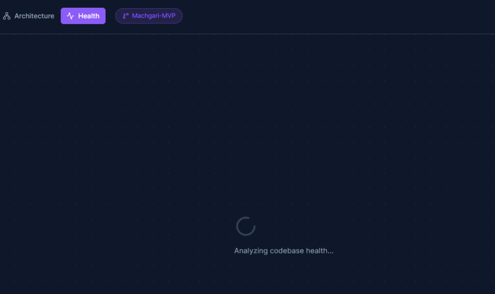

# OpenSource Compass 🧭

Paste a GitHub URL. Get an interactive architecture map, AI chat, and codebase health report — in under 60 seconds.


> 📹 Demo: analyzing the FastAPI repository

[](https://opensource-compass.vercel.app)
[](https://github.com/Roza212/opensource_compass)

[](https://d3js.org/)
[](https://deepmind.google/technologies/gemini/)
[](https://fastapi.tiangolo.com/)
[](https://supabase.com/)

## What it does

Drop any GitHub URL to trigger autonomous cloning, multi-language AST parsing across 14 languages, and semantic vector embedding. Navigate your codebase through an interactive D3 tree featuring drill-down capabilities, a real-time minimap, language color-coding, and node-level AI explanations. Gain instant insights via a 4-dimension health scoring system (Complexity, Coupling, Size, Docs) that identifies top risks and provides cross-navigation directly back to the architecture tree.

## Screenshots

|  |  |
|:---:|:---:|
| "Enter any public GitHub URL" | "Interactive D3 architecture tree with minimap" |
|  |  |
| "4-dimension health dashboard with top risks" | "RAG-powered AI chat with source citations" |

## How it works

### Ingestion pipeline
- shallow git clone for high-speed local processing
- tree-sitter AST parsing per language to extract structural units
- semantic chunking that keeps functions and classes whole
- SentenceTransformers MiniLM-L6 embeddings generated locally
- pgvector storage for semantic search and NetworkX for dependency graph construction

### Query pipeline
- user question converted to vector using the same local embedding model
- cosine similarity search in pgvector to find relevant code context
- cross-encoder reranking to refine the top 15 results down to the best 5
- LangChain prompt construction incorporating retrieved code context
- Gemini 1.5 Pro streaming response including precise source citations

## Tech stack

| Technology | Why |
|:---|:---|
| **D3.js** | "custom collapsible tree with zoom, minimap, and drill-down" |
| **Gemini 1.5 Pro** | "long context window handles large code chunks" |
| **SentenceTransformers** | "runs locally, no API cost for embeddings" |
| **Celery + Redis** | "non-blocking ingestion for large repos" |
| **pgvector** | "cosine similarity search co-located with metadata" |
| **NetworkX** | "coupling metrics from import dependency graph" |

## Quick start

### Primary path (Docker)
```bash
git clone https://github.com/Roza212/opensource_compass
cp backend/.env.example backend/.env  # fill in your keys
docker-compose up
```
Then open [http://localhost:5173](http://localhost:5173)

### Secondary path (Manual)
<details>
<summary>View manual installation steps</summary>

1. **Start Redis**: Ensure the Redis service is running locally.
2. **Start Backend**: 
   ```bash
   cd backend
   pip install -r requirements.txt
   uvicorn main:app --reload
   ```
3. **Start Worker**: 
   ```bash
   cd backend
   celery -A app.worker.celery_app worker --loglevel=info --pool=solo
   ```
4. **Start Frontend**: 
   ```bash
   cd frontend
   npm install
   npm run dev
   ```
</details>

## Environment variables

```env
# Google API Key for Gemini Pro LLM
GOOGLE_API_KEY=your_gemini_key

# Supabase connection URL for pgvector and metadata
SUPABASE_URL=your_supabase_url

# Supabase service role or anon key
SUPABASE_KEY=your_supabase_key

# Redis URL for Celery task queuing and rate limiting
REDIS_URL=redis://localhost:6379/0

# Celery broker URL (usually same as Redis)
CELERY_BROKER_URL=redis://localhost:6379/0
```

## API reference

| Method | Endpoint | Description |
|--------|----------|-------------|
| `POST` | `/ingest` | Initiate async repo ingestion (returns Job ID) |
| `GET`  | `/status/{repo}` | Poll ingestion status & progress |
| `GET`  | `/tree/{repo}` | Fetch hierarchical D3 JSON for visualization |
| `GET`  | `/analyze/{repo}` | Generate 4-dimension Health & Complexity report |
| `POST` | `/chat` | Contextual AI mentorship (with RAG context) |

## Project structure

```text
opensource_compass/
├── .temp_repos/                 # Persistent storage for analyzed repositories
├── backend/
│   ├── main.py                  # API Entry Point
│   ├── app/
│   │   ├── api/                 # Routers (Chat, Ingest, Diagram, Analyze)
│   │   ├── services/            # Logic (VectorStore, GitService, ChatEngine)
│   │   ├── utils/               # Helpers (Chunker, GraphBuilder, Radon)
│   │   └── worker.py            # Celery Background Tasks
│   └── requirements.txt         # Backend Dependencies
│
└── frontend/
    ├── src/
    │   ├── api/                 # Centralized API Client
    │   ├── components/          # UI Components (TreeDiagram, SidePanel)
    │   └── views/               # Page Layouts (Dashboard, Landing)
```

Built with Python, React, and too much curiosity about other people's codebases.

Distributed under the MIT License. See `LICENSE` for more information.
